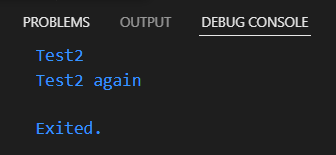
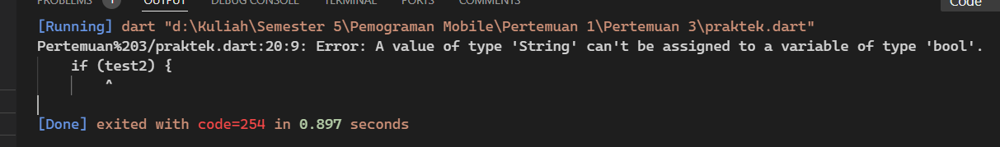
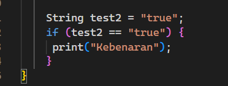
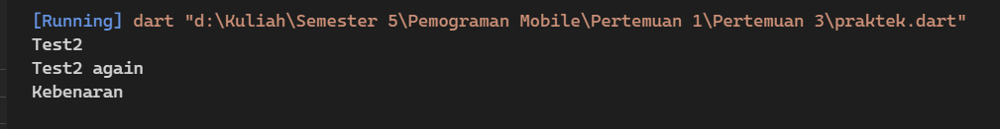

### Praktikum 1  
Silakan coba eksekusi (Run) kode pada langkah 1 tersebut. Apa yang terjadi? Jelaskan!

 Jawaban :  

 
pada hasil yang diberikan dikarenakan variable test berisi test2 sehingga hanya test 2 yang akan dijalankan 
  
Tambahkan kode program berikut, lalu coba eksekusi (Run) kode Anda.Apa yang terjadi ? Jika terjadi error, silakan perbaiki namun tetap menggunakan if/else.

  Perbaikan  

pada perbaikan diatas ditambahkan koondisi yang sama dengan inisialisasi yang telah diberikan ke variabel sehngga hasilnya true

### Praktikum 2  
Silakan coba eksekusi (Run) kode pada langkah 1 tersebut. Apa yang terjadi? Jelaskan! Lalu perbaiki jika terjadi error.
 Jawaban :
akan terjadi eror karena variabel counter belum inisialisi dan instansiasi sehingga menyebabkan error

### Praktikum 3  
  Silakan coba eksekusi (Run) kode pada langkah 1 tersebut. Apa yang terjadi? Jelaskan! Lalu perbaiki jika terjadi error.
 
Jawaban : Eror disebabkan terjadi kesalahan penulisan pada index dan variabel index belum diinisialisasi sehingga error dan tidak ada limit sehingga terjadi infinity loop

 
Apa yang terjadi ? Jika terjadi error, silakan perbaiki namun tetap menggunakan for dan break-continue. 
Jawaban : terjadi kesalahan penulisan pada if, else if, index dan sytax yang ada pada praktikum tidak dibungkus oleh perulangan sehingga menyebabkan error
