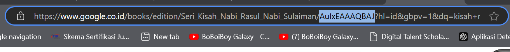
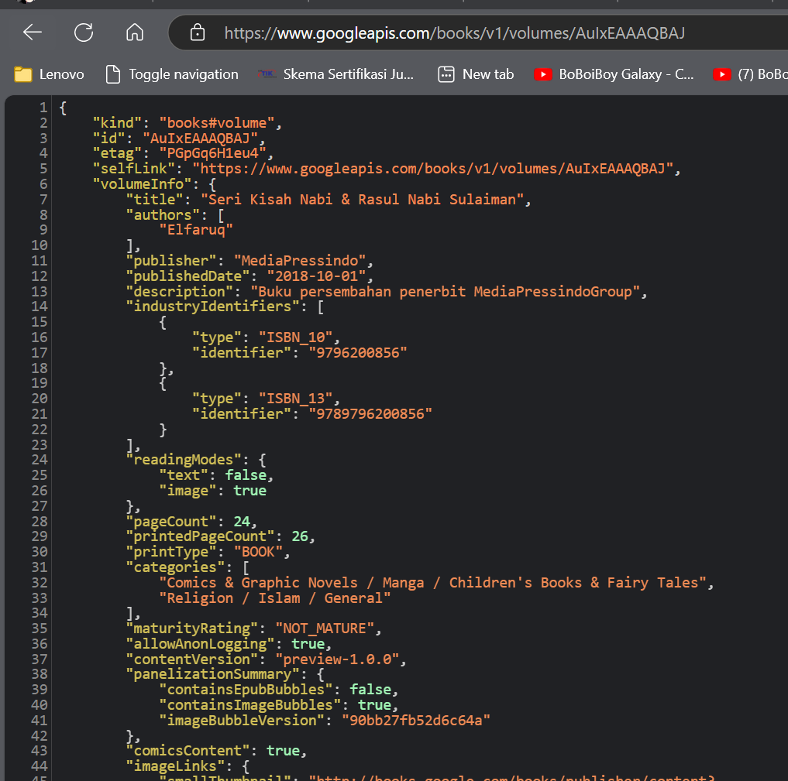
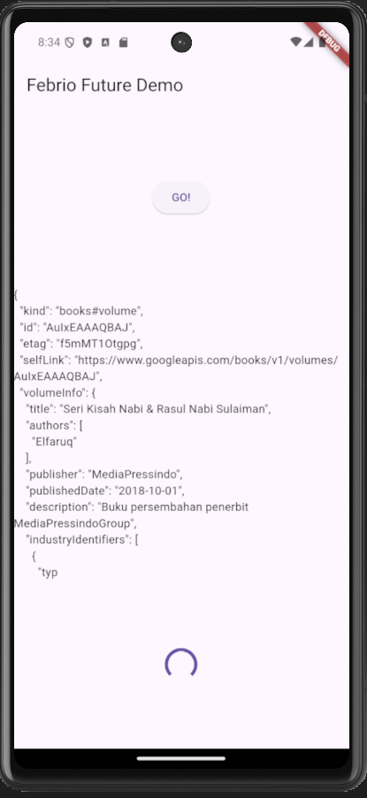
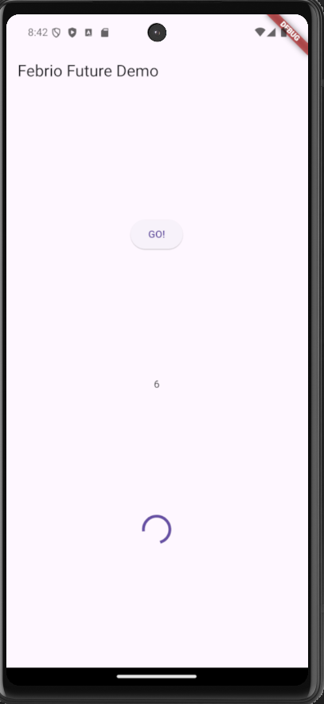
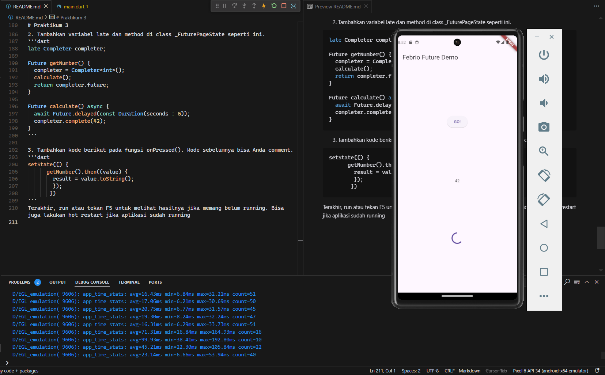
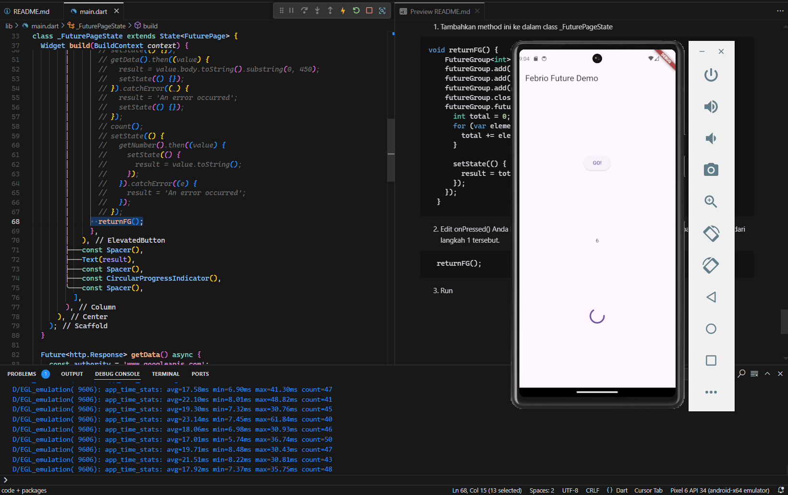
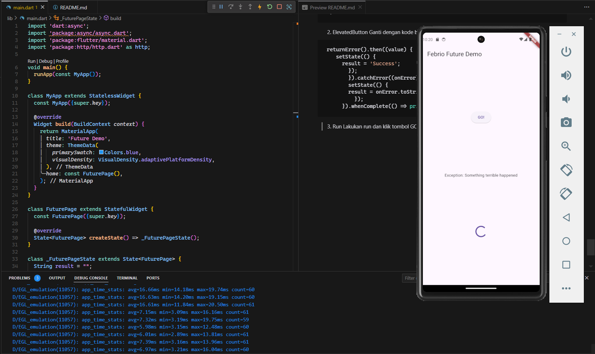
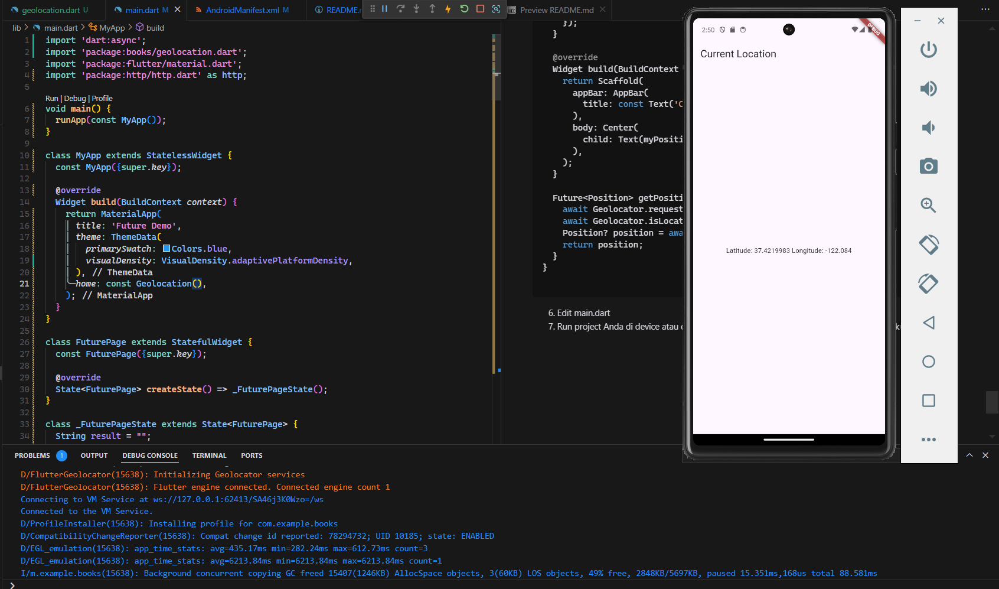
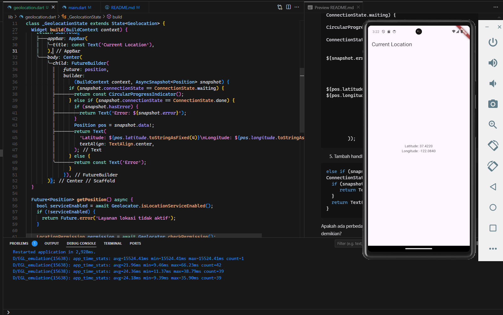

# Praktikum 1

1. Tambahkan dependensi http

```dart
flutter pub add http
```

Cek file pubspec.yaml

```dart
dependencies:
  flutter:
    sdk: flutter
  http: ^1.1.0
```

2. Buka file main.dart<br>
   Ketiklah kode seperti berikut ini.

```dart
void main() {
  runApp(const MyApp());
}

class MyApp extends StatelessWidget {
  const MyApp({super.key});

  @override
  Widget build(BuildContext context) {
    return MaterialApp(
      title: 'Future Demo',
      theme: ThemeData(
        primarySwatch: Colors.blue,
        visualDensity: VisualDensity.adaptivePlatformDensity,
      ),
      home: const FuturePage(),
    );
  }
}

class FuturePage extends StatefulWidget {
  const FuturePage({super.key});

  @override
  State<FuturePage> createState() => _FuturePageState();
}

class _FuturePageState extends State<FuturePage> {
  String result = "";

  @override
  Widget build(BuildContext context) {
    return Scaffold(
      appBar: AppBar(
        title: const Text('Febrio Future Demo'),
      ),
      body: Center(
        child: Column(
          mainAxisAlignment: MainAxisAlignment.center,
          children: [
            const Spacer(),
            ElevatedButton(
              child: const Text('GO!'),
              onPressed: () {
                setState(() {});
                getData().then((value) {
                  result = value.body.toString().substring(0, 450);
                  setState(() {});
                }).catchError((_) {
                  result = 'An error occurred';
                  setState(() {});
                });
              },
            ),
            const Spacer(),
            Text(result),
            const Spacer(),
            const CircularProgressIndicator(),
            const Spacer(),
          ],
        ),
      ),
    );
  }}
```

3.  Tambah method getData()<br>
    Tambahkan method ini ke dalam class \_FuturePageState yang berguna untuk mengambil data dari API Google Books.

```dart
Future<http.Response> getData() async {
    const authority = 'www.googleapis.com';
    const path = '/books/v1/volumes/AuIxEAAAQBAJ';
    Uri url = Uri.https(authority, path);
    return http.get(url);
  }
```

- Carilah judul buku favorit Anda di Google Books, lalu ganti ID buku pada variabel path di kode tersebut. Caranya ambil di URL browser Anda seperti gambar berikut ini.
  
- Kemudian cobalah akses di browser URI tersebut dengan lengkap seperti ini. Jika menampilkan data JSON, maka Anda telah berhasil. Lakukan capture milik Anda dan tulis di README
  

4. Tambah kode di ElevatedButton<br>
   Tambahkan kode pada onPressed di ElevatedButton seperti berikut.

```dart
 ElevatedButton(
              child: const Text('GO!'),
              onPressed: () {
                setState(() {});
                getData().then((value) {
                  result = value.body.toString().substring(0, 450);
                  setState(() {});
                }).catchError((_) {
                  result = 'An error occurred';
                  setState(() {});
                });
              },
            ),
```

- Jelaskan maksud kode langkah 5 tersebut terkait substring dan catchError!<br>
  Jawaban : Kode ini kemudian menggunakan substring(0, 450) untuk mengambil hanya 450 karakter pertama dari respons sebagai string, yang akan ditampilkan di layar aplikasi. Ini bertujuan untuk membatasi jumlah teks yang ditampilkan, sehingga hanya bagian awal data yang terlihat.
  <br><br>Namun, jika terjadi kesalahan selama proses permintaan data, seperti masalah jaringan atau respons yang tidak valid, fungsi catchError akan menangani kesalahan ini. Dalam hal ini, variabel result diubah menjadi teks "An error occurred", menunjukkan kepada pengguna bahwa ada kendala dalam pengambilan data. setState dipanggil untuk memperbarui UI setiap kali result berubah, baik dari hasil respons maupun pesan error.



# Praktikum 2

1. Buka file main.dart <br>
   Tambahkan tiga method berisi kode seperti berikut di dalam class \_FuturePageState.

```dart
Future<int> returnOneAsync() async {
  await Future.delayed(const Duration(seconds: 3));
  return 1;
}

Future<int> returnTwoAsync() async {
  await Future.delayed(const Duration(seconds: 3));
  return 2;
}

Future<int> returnThreeAsync() async {
  await Future.delayed(const Duration(seconds: 3));
  return 3;
}
```

2. Tambah method count()<br>
   Lalu tambahkan lagi method ini di bawah ketiga method sebelumnya.

```dart
  Future count() async {
    int total = 0;
    total = await returnOneAsync();
    total += await returnTwoAsync();
    total += await returnThreeAsync();
    setState(() {
      result = total.toString();
    });
  }
```
3. Panggil count()<br>
Lakukan comment kode sebelumnya, ubah isi kode onPressed() menjadi seperti berikut.
```dart
            ElevatedButton(
              child: const Text('GO!'),
              onPressed: () {
                count();
              },
            ),
```
<br>
Jelaskan maksud kode langkah 1 dan 2 tersebut!<br>
kode dari langkah 1 dan adalah contoh pembuatan function async dengan memberikan delay 3 detik dan mereturn nilai int lalau pada kode langkah 2 membuat fungsi async yang menunggu dari fungsi async sebelumnya lalu menjumlahkannya dan mengatur state

# Praktikum 3
1. Pastikan telah impor package async berikut.
```dart
import 'package:async/async.dart';
```

2. Tambahkan variabel late dan method di class _FuturePageState seperti ini.
```dart
late Completer completer;

Future getNumber() {
  completer = Completer<int>();
  calculate();
  return completer.future;
}

Future calculate() async {
  await Future.delayed(const Duration(seconds : 5));
  completer.complete(42);
}
```

3. Tambahkan kode berikut pada fungsi onPressed(). Kode sebelumnya bisa Anda comment.
```dart
setState(() {
      getNumber().then((value) {
        result = value.toString();
        });
       })
```
Terakhir, run atau tekan F5 untuk melihat hasilnya jika memang belum running. Bisa juga lakukan hot restart jika aplikasi sudah running

4. Gantilah isi code method calculate() seperti kode berikut, atau Anda dapat membuat calculate2()
```dart
  try {
      await Future.delayed(const Duration(seconds: 5));
      completer.complete(42);
    } catch (_) {
      completer.completeError({});
    }
```
5.  Pindah ke onPressed() Ganti menjadi kode seperti berikut.
```dart
getNumber().then((value) {
  setState(() {
    result = value.toString();
  });
}).catchError((e) {
  result = 'An error occurred';
});
```

Jelaskan maksud perbedaan kode langkah 2 dengan langkah 5-6 tersebut!<br>
jawaban : Pada langkah 2 membuat sebuah variabel dengan tipe data Completer dan membuat fungsi future getNumber yang menjalankan fungsi future calculate dengan delayed 5 detik dan mereturn nilai complete 42. Dengan menggunakan completer maka bisa mereturn nilai value jika berhasil atau error jika gagal

# Praktikum 4
1. Tambahkan method ini ke dalam class _FuturePageState
```dart
void returnFG() {
    FutureGroup<int> futureGroup = FutureGroup<int>();
    futureGroup.add(returnOneAsync());
    futureGroup.add(returnTwoAsync());
    futureGroup.add(returnThreeAsync());
    futureGroup.close();
    futureGroup.future.then((List<int> values) {
      int total = 0;
      for (var element in values) {
        total += element;
      }

      setState(() {
        result = total.toString();
      });
    });
  }
```
2. Edit onPressed() Anda bisa hapus atau comment kode sebelumnya, kemudian panggil method dari langkah 1 tersebut.
```dart
  returnFG();
```
3. Run<br>

4. Anda dapat menggunakan FutureGroup dengan Future.wait seperti kode berikut.
```dart
final futures = Future.wait<int>([
  returnOneAsync(),
  returnTwoAsync(),
  returnThreeAsync(),
]);
```
Jelaskan maksud perbedaan kode langkah 1 dan 4!<br>
jawaban : Perbedaan langkah 1 dan 4 adalah dalam menghandling beberapa future, pada langkah 1 perlu menggunakan futuregroup dengan tipe datra int dan menambahkannya seperti pada list, dan pada langkah 4 langsung seperti pendeklarasian list dengan isian dari beberapa fungsi async
# Praktikum 5
1. Tambahkan method ini ke dalam class _FuturePageState
```dart
 Future returnError() async {
    await Future.delayed(const Duration(seconds: 2));
    throw Exception('Something terrible happened');
  }
```
2. ElevatedButton Ganti dengan kode berikut
```dart
 returnError().then((value) {
    setState(() {
      result = 'Success';
        });
        }).catchError((onError) {
        setState(() {
        result = onError.toString();
          });
      }).whenComplete(() => print("complete"));
```
3. Run Lakukan run dan klik tombol GO! maka akan menghasilkan seperti gambar berikut.

4.  Tambah method handleError() Tambahkan kode ini di dalam class _FutureStatePage
```dart
Future handleError() async {
    try {
      await returnError();
    } catch (error) {
      setState(() {
        result = error.toString();
      });
    } finally {
      print('complete');
    }
  }
```
Panggil method handleError() tersebut di ElevatedButton, lalu run. Apa hasilnya? Jelaskan perbedaan kode langkah 1 dan 4!<br>
Jawaban : Perbedaan pada try catch yang di bungkus dalam sebuah fungsi atau chaining dari async

# Praktikum 6
1.  install plugin geolocator
```
flutter pub add geolocator
```
2.  Tambah permission GPS
```
<uses-permission android:name="android.permission.ACCESS_FINE_LOCATION"/>
<uses-permission android:name="android.permission.ACCESS_COARSE_LOCATION"/>
```
3. Buat file geolocation.dart
4. Buat class LocationScreen di dalam file geolocation.dart
```dart
class Geolocation extends StatefulWidget {
  const Geolocation({super.key});

  @override
  State<Geolocation> createState() => _GeolocationState();
}

class _GeolocationState extends State<Geolocation> {
  String myPosition = '';
  @override
  void initState() {
    super.initState();
    getPosition().then((Position myPods) {
      myPosition =
          'Latitude: ${myPods.latitude.toString()} Longitude: ${myPods.longitude.toString()}';
      setState(() {
        myPosition = myPosition;
      });
    });
  }

  @override
  Widget build(BuildContext context) {
    return Scaffold(
      appBar: AppBar(
        title: const Text('Current Location'),
      ),
      body: Center(
        child: Text(myPosition),
      ),
    );
  }

  Future<Position> getPosition() async {
    await Geolocator.requestPermission();
    await Geolocator.isLocationServiceEnabled();
    Position? position = await Geolocator.getCurrentPosition();
    return position;
  }
}

```
6.  Edit main.dart
7. Run project Anda di device atau emulator (bukan browser), maka akan tampil seperti berikut ini.


# Praktikum 7
1. Modifikasi method getPosition()
```dart
Future<Position> getPosition() async {
    await Geolocator.isLocationServiceEnabled();
    await Future.delayed(const Duration(seconds: 3));
    Position? position = await Geolocator.getCurrentPosition();
    return position;
  }
```
2. Tambah variabel
```dart
  Future<Position>? position;
```
3. Tambah initState()
```dart
 @override
  void initState() {
    super.initState();
    position = getPosition();
  }
```
4. Edit method build()
```dart
return Scaffold(
        appBar: AppBar(
          title: const Text('Current Location'),
        ),
        body: Center(
          child: FutureBuilder(
              future: position,
              builder:
                  (BuildContext context, AsyncSnapshot<Position> snapshot) {
                if (snapshot.connectionState == ConnectionState.waiting) {
                  return const CircularProgressIndicator();
                } else if (snapshot.connectionState == ConnectionState.done) {
                  if (snapshot.hasError) {
                    return Text('Error: ${snapshot.error}');
                  }
                  Position pos = snapshot.data!;
                  return Text(
                    'Latitude: ${pos.latitude.toStringAsFixed(4)}\nLongitude: ${pos.longitude.toStringAsFixed(4)}',
                    textAlign: TextAlign.center,
                  );
                } else {
                  return const Text('Error');
                }
              }),
        ));
```
5. Tambah handling error
```dart
else if (snapshot.connectionState == ConnectionState.done) {
  if (snapshot.hasError) {
     return Text('Something terrible happened!');
  }
  return Text(snapshot.data.toString());
}
```


Apakah ada perbedaan UI dengan praktikum sebelumnya? Mengapa demikian?<br>
Jawaban : Tidak ada perbedaan dengan UI sebelumnya, hanya saja handling pada data masih di proses dan sudah memiliki perbedaan dan juga terdapat handling bila error<br><br>
Apakah ada perbedaan UI dengan langkah sebelumnya? Mengapa demikian?<br>
jawaban :Tidak ada perbedaan dengan UI sebelumnya,namun jika terjadi error saat process data maka akan menghasilkan text berbeda

# Praktikum 8
1. Buat file baru navigation_first.dart

2. Isi kode navigation_first.dart
```dart
class NavigationFirts extends StatefulWidget {
  const NavigationFirts({super.key});

  @override
  State<NavigationFirts> createState() => _NavigationFirtsState();
}

class _NavigationFirtsState extends State<NavigationFirts> {
  Color color = Colors.blue.shade700;
  @override
  Widget build(BuildContext context) {
    return Scaffold(
      backgroundColor: color,
      appBar: AppBar(
        title: const Text('Navigation First'),
      ),
      body: Center(
        child: ElevatedButton(
          onPressed: () {
            _navigateAndGetColor(context);
          },
          child: const Text('Change Color')
        ),
      ),
    );
  }
}
```
3. Tambah method di class _NavigationFirstState
```dart
Future _navigateAndGetColor(BuildContext context) async {
   color = await Navigator.push(context,
        MaterialPageRoute(builder: (context) => const NavigationSecond()),) ?? Colors.blue;
   setState(() {});
   });
}
```
4. Buat file baru navigation_second.dart
5. Buat class NavigationSecond dengan StatefulWidget
```dart
class NavigationSecond extends StatefulWidget {
  const NavigationSecond({super.key});

  @override
  State<NavigationSecond> createState() => _NavigationSecondState();
}

class _NavigationSecondState extends State<NavigationSecond> {
  @override
  Widget build(BuildContext context) {
    Color color;

    return Scaffold(
      appBar: AppBar(
        title: const Text("Navigation Second Screen"),
      ),
      body: Center(
        child: Column(
          mainAxisAlignment: MainAxisAlignment.spaceEvenly,
          children: [
            ElevatedButton(
                onPressed: () {
                  color = Colors.red.shade700;
                  Navigator.pop(context, color);
                },
                child: const Text('red')),
            ElevatedButton(
                onPressed: () {
                  color = Colors.green.shade700;
                  Navigator.pop(context, color);
                },
                child: const Text('green')),
            ElevatedButton(
                onPressed: () {
                  color = Colors.blue.shade700;
                  Navigator.pop(context, color);
                },
                child: const Text('Blue')),
          ],
        ),
      ),
    );
  }
}
```
6.  Edit main.dart
```
 home: const NavigationFirts(),
```


Cobalah klik setiap button, apa yang terjadi ? Mengapa demikian ?<br>
Ketika tombol "Change Color" di layar pertama ditekan, aplikasi akan menampilkan layar kedua yang berisi tiga tombol warna (merah, hijau, biru). Setiap tombol di layar kedua ketika ditekan akan mengirimkan data warna menggunakan Navigator.pop(context, color) kembali ke layar pertama, dimana data warna tersebut akan ditangkap oleh fungsi _navigateAndGetColor yang async dan menggunakan setState untuk memperbarui warna latar belakang layar pertama sesuai dengan warna yang dipilih. Jika tidak ada warna yang dipilih (pengguna langsung kembali), warna default biru akan digunakan.

# Praktikum 9 
1.  Buat file baru navigation_dialog.dart
2.  Isi kode navigation_dialog.dart
```dart
class NavigationDialog extends StatefulWidget {
  const NavigationDialog({super.key});

  @override
  State<NavigationDialog> createState() => _NavigationDialogState();
}

class _NavigationDialogState extends State<NavigationDialog> {
  Color color = Colors.blue.shade700;
   @override
  Widget build(BuildContext context) {
    print(color);
    return Scaffold(
      backgroundColor: color,
      appBar: AppBar(
        title: const Text('Navigation Dialog Screen'),
      ),
      body: Center(
        child: ElevatedButton(
            onPressed: () {
              _showColorDialog(context);
            },
            child: const Text('Change Color')),
      ),
    );
  }
}
```
3. Tambah method async
```dart

  _showColorDialog(BuildContext context) async {
    await showDialog(
        context: context,
        barrierDismissible: false,
        builder: (_) {
          return AlertDialog(
            title: const Text("Very important question"),
            content: const Text('Please choose a color'),
            actions: <Widget>[
              TextButton(
                  onPressed: () {
                    color = Colors.red.shade700;
                    Navigator.pop(context, color);
                  },
                  child: Text('Red')),
              TextButton(
                  onPressed: () {
                    color = Colors.green.shade700;
                    Navigator.pop(context, color);
                  },
                  child: Text('green')),
              TextButton(
                  onPressed: () {
                    color = Colors.blue.shade700;
                    Navigator.pop(context, color);
                  },
                  child: Text('blue'))
            ],
          );
        });

    setState(() {});
  }
```
4. Panggil method di ElevatedButton
5. Edit main.dart
```
     home: const NavigationDialog(),
```


Cobalah klik setiap button, apa yang terjadi ? Mengapa demikian ?<br  >
Jawaban : Pada kode tersebut, terdapat beberapa fungsi yang diimplementasikan dengan button yang berbeda. Di `lib/main.dart`, button "GO!" memiliki beberapa fungsi yang dikomentari (tidak aktif) dan satu fungsi aktif yaitu `handleError()` yang akan menampilkan pesan error setelah delay 2 detik. Sedangkan di `lib/navigation_dialog.dart`, terdapat button "Change Color" yang ketika diklik akan memunculkan dialog dengan 3 pilihan warna (merah, hijau, biru) - ketika salah satu warna dipilih, background color dari Scaffold akan berubah sesuai dengan warna yang dipilih karena adanya `setState()` yang memperbarui variable `color`. Dialog ini tidak bisa ditutup dengan mengklik area di luar dialog karena property `barrierDismissible` diset `false`, sehingga user harus memilih salah satu warna untuk menutup dialog tersebut.