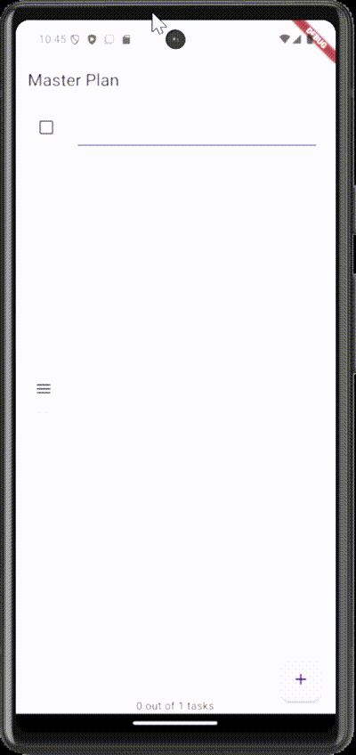
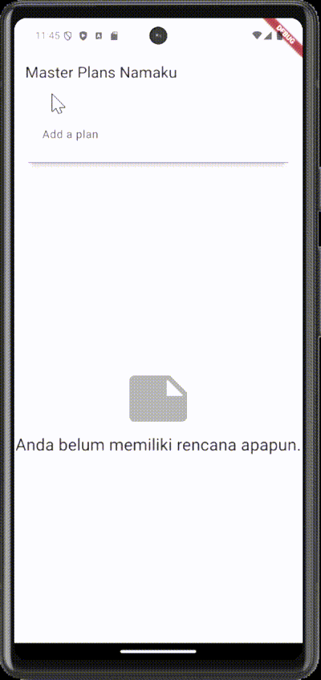

# Praktikum 1

1. Membuat model task.dart<br>
   Class ini memiliki atribut description dengan tipe data String dan complete dengan tipe data Boolean, serta ada konstruktor. Kelas ini akan menyimpan data tugas untuk aplikasi kita. Tambahkan kode berikut:

```dart
class Task {
 final String description;
 final bool complete;

 const Task({
   this.complete = false,
   this.description = '',
 });
}
```

2.  Buat file plan.dart<br>
    Kita juga perlu sebuah List untuk menyimpan daftar rencana dalam aplikasi to-do ini. Buat file plan.dart di dalam folder models

```dart
import './task.dart';

class Plan {
 final String name;
 final List<Task> tasks;

 const Plan({this.name = '', this.tasks = const []});
}
```

3.  Buat file data_layer.dart<br>
    Kita dapat membungkus beberapa data layer ke dalam sebuah file yang nanti akan mengekspor kedua model tersebut. Dengan begitu, proses impor akan lebih ringkas seiring berkembangnya aplikasi. Buat file bernama data_layer.dart

```dart
export 'plan.dart';
export 'task.dart';
```

4. Pindah ke file main.dart<br>
   Ubah isi kode main.dart sebagai berikut.

```dart
import 'package:flutter/material.dart';
import './views/plan_screen.dart';

void main() => runApp(MasterPlanApp());

class MasterPlanApp extends StatelessWidget {
  const MasterPlanApp({super.key});

  @override
  Widget build(BuildContext context) {
    return MaterialApp(
     theme: ThemeData(primarySwatch: Colors.purple),
     home: PlanScreen(),
    );
  }
}
```

5. buat plan_screen.dart<br>
   Pada folder views, buatlah sebuah file plan_screen.dart dan gunakan templat StatefulWidget untuk membuat class PlanScreen

```dart
import '../models/data_layer.dart';
import 'package:flutter/material.dart';

class PlanScreen extends StatefulWidget {
  const PlanScreen({super.key});

  @override
  State createState() => _PlanScreenState();
}

class _PlanScreenState extends State<PlanScreen> {
  Plan plan = const Plan();

  @override
  Widget build(BuildContext context) {
   return Scaffold(
    // ganti ‘Namaku' dengan Nama panggilan Anda
    appBar: AppBar(title: const Text('Master Plan Namaku')),
    body: _buildList(),
    floatingActionButton: _buildAddTaskButton(),
   );
  }
}
```

6.  buat method \_buildAddTaskButton()<br>
    Anda akan melihat beberapa error di langkah 6, karena method yang belum dibuat. Ayo kita buat mulai dari yang paling mudah yaitu tombol Tambah Rencana. Tambah kode berikut di bawah method build di dalam class \_PlanScreenState.

```dart
Widget _buildAddTaskButton() {
  return FloatingActionButton(
   child: const Icon(Icons.add),
   onPressed: () {
     setState(() {
      plan = Plan(
       name: plan.name,
       tasks: List<Task>.from(plan.tasks)
       ..add(const Task()),
     );
    });
   },
  );
}
```

7. buat widget \_buildList() <br>
   Kita akan buat widget berupa List yang dapat dilakukan scroll, yaitu ListView.builder. Buat widget ListView seperti kode berikut ini.

```dart
Widget _buildList() {
  return ListView.builder(
   itemCount: plan.tasks.length,
   itemBuilder: (context, index) =>
   _buildTaskTile(plan.tasks[index], index),
  );
}
```

8.  buat widget \_buildTaskTile<br>
    Dari langkah 8, kita butuh ListTile untuk menampilkan setiap nilai dari plan.tasks. Kita buat dinamis untuk setiap index data, sehingga membuat view menjadi lebih mudah

```dart
 Widget _buildTaskTile(Task task, int index) {
    return ListTile(
      leading: Checkbox(
          value: task.complete,
          onChanged: (selected) {
            setState(() {
              plan = Plan(
                name: plan.name,
                tasks: List<Task>.from(plan.tasks)
                  ..[index] = Task(
                    description: task.description,
                    complete: selected ?? false,
                  ),
              );
            });
          }),
      title: TextFormField(
        initialValue: task.description,
        onChanged: (text) {
          setState(() {
            plan = Plan(
              name: plan.name,
              tasks: List<Task>.from(plan.tasks)
                ..[index] = Task(
                  description: text,
                  complete: task.complete,
                ),
            );
          });
        },
      ),
    );
  }
```

9. Tambah Scroll Controller<br>
   Anda dapat menggunakan ScrollController untuk menghapus focus dari semua TextField selama event scroll dilakukan. Pada file plan_screen.dart, tambahkan variabel scroll controller di class State tepat setelah variabel plan

```dart
late ScrollController scrollController;
```

10. Tambah Scroll Listener<br>
    Tambahkan method initState() setelah deklarasi variabel scrollController seperti kode berikut.

```dart
@override
void initState() {
  super.initState();
  scrollController = ScrollController()
    ..addListener(() {
      FocusScope.of(context).requestFocus(FocusNode());
    });
}
```

11. Tambah controller dan keyboard behavior

```dart
return ListView.builder(
  controller: scrollController,
 keyboardDismissBehavior: Theme.of(context).platform ==
 TargetPlatform.iOS
          ? ScrollViewKeyboardDismissBehavior.onDrag
          : ScrollViewKeyboardDismissBehavior.manual,
```

12. Terakhir, tambah method dispose()
    

# Tugas Praktikum 1

2. Jelaskan maksud dari langkah 4 pada praktikum tersebut! Mengapa dilakukan demikian<br>
   Jawaban : Untuk melakukan eksport pada models, sehingga proses import hanya dilakukan sekali pada views
3. Mengapa perlu variabel plan di langkah 6 pada praktikum tersebut? Mengapa dibuat konstanta ?<br>
   Jawaban : Agar objek tidak dapat diubah lagi setelah pendeklarasian objek, sehingga pada tahap2 selanjutnya proses menjadi duplikasi objek baru.
4. Lakukan capture hasil dari Langkah 9 berupa GIF, kemudian jelaskan apa yang telah Anda buat!
   <br>
   
   <br> Jawaban : membentuk sebuah listile yang didasarkan pada jumlah task pada plan, pada set state checkbox apa bila terjadi perubahan checkbox maka variabel pada task boolean menjadi true atau false. semua perubahan akan terjadi pada variabel plan, sehinga terjadi perubahan secara terus menerus pada variabel plan
5. Apa kegunaan method pada Langkah 11 dan 13 dalam lifecyle state ?<br> Jawaban :
   ScrollListener digunakan apabila, tampilan melebihi batasan device maka akan dilakukan listener pada scroll seperti fokus.

# Praktikum 2

1.  Buat file plan_provider.dart

```dart
import 'package:flutter/material.dart';
import '../models/data_layer.dart';

class PlanProvider extends InheritedNotifier<ValueNotifier<Plan>> {
  const PlanProvider({super.key, required Widget child, required
   ValueNotifier<Plan> notifier})
  : super(child: child, notifier: notifier);

  static ValueNotifier<Plan> of(BuildContext context) {
   return context.
    dependOnInheritedWidgetOfExactType<PlanProvider>()!.notifier!;
  }
}
```

2. Edit main.dart<br>
   Gantilah pada bagian atribut home dengan PlanProvider

```dart
return MaterialApp(
  theme: ThemeData(primarySwatch: Colors.purple),
  home: PlanProvider(
    notifier: ValueNotifier<Plan>(const Plan()),
    child: const PlanScreen(),
   ),
);
```

3. Tambah method pada model plan.dart
   <br>Tambahkan dua method di dalam model class Plan

```dart
int get completedCount => tasks
  .where((task) => task.complete)
  .length;

String get completenessMessage =>
  '$completedCount out of ${tasks.length} tasks';
```

4.  Pindah ke PlanScreen
    <br> Edit PlanScreen agar menggunakan data dari PlanProvider. Hapus deklarasi variabel plan (ini akan membuat error). Kita akan perbaiki pada langkah 5 berikut ini.

5.  Edit method \_buildAddTaskButton

```dart
Widget _buildAddTaskButton() {
    return FloatingActionButton(
      child: const Icon(Icons.add),
      onPressed: () {
        setState(() {
          Plan currentPlan = plantNotifier.value;
          plantNotifier.value = Plan(
            name: currentPlan.name,
            tasks: List<Task>.from(currentPlan.tasks)
              ..add(const Task(description: '', complete: false)),
          );
        });
      },
    );
  }
```

6. Edit method \_buildTaskTile

```dart
Widget _buildTaskTile(Task task, int index, BuildContext context) {
  ValueNotifier<Plan> planNotifier = PlanProvider.of(context);
  return ListTile(
    leading: Checkbox(
       value: task.complete,
       onChanged: (selected) {
         Plan currentPlan = planNotifier.value;
         planNotifier.value = Plan(
           name: currentPlan.name,
           tasks: List<Task>.from(currentPlan.tasks)
             ..[index] = Task(
               description: task.description,
               complete: selected ?? false,
             ),
         );
       }),
    title: TextFormField(
      initialValue: task.description,
      onChanged: (text) {
        Plan currentPlan = planNotifier.value;
        planNotifier.value = Plan(
          name: currentPlan.name,
          tasks: List<Task>.from(currentPlan.tasks)
            ..[index] = Task(
              description: text,
              complete: task.complete,
            ),
        );
      },
    ),
  );
}
```

7. Edit \_buildList

```dart
Widget _buildList(Plan plan) {
   return ListView.builder(
     controller: scrollController,
     itemCount: plan.tasks.length,
     itemBuilder: (context, index) =>
        _buildTaskTile(plan.tasks[index], index, context),
   );
}
```

8. Tambah widget SafeArea<br>
   Terakhir, tambahkan widget SafeArea dengan berisi completenessMessage pada akhir widget Column. Perhatikan kode berikut ini.

```dart
 return Scaffold(
     appBar: AppBar(title: const Text('Master Plan')),
     body: ValueListenableBuilder<Plan>(
       valueListenable: PlanProvider.of(context),
       builder: (context, plan, child) {
         return Column(
           children: [
             Expanded(child: _buildList(plan)),
             SafeArea(child: Text(plan.completenessMessage))
           ],
         );
       },
     ),
     floatingActionButton: _buildAddTaskButton(),
   );
```

# Tugas Praktikum 2

2. Jelaskan mana yang dimaksud InheritedWidget pada langkah 1 tersebut! Mengapa yang digunakan InheritedNotifier?
   <br> Jawaban :Inhertied Widget Digunakan untuk menyediakan data, sehingga data bisa di akses ke widget child.<br>Inherited Notifiee Digunakan untuk me- listen sebuah objek yang ketika objek itu berubah maka, akan melakukan rebuild widget sehingga data sesuai.
3. Jelaskan maksud dari method di langkah 3 pada praktikum tersebut! Mengapa dilakukan demikian?

4. Lakukan capture hasil dari Langkah 9 berupa GIF, kemudian jelaskan apa yang telah Anda buat!
   

# Praktikum 3

1. Edit PlanProvider

```dart
class PlanProvider extends
InheritedNotifier<ValueNotifier<List<Plan>>> {
  const PlanProvider({super.key, required Widget child, required
ValueNotifier<List<Plan>> notifier})
     : super(child: child, notifier: notifier);

  static ValueNotifier<List<Plan>> of(BuildContext context) {
    return context.
dependOnInheritedWidgetOfExactType<PlanProvider>()!.notifier!;
  }
}
```

2. Edit main.dart

```dart
@override
Widget build(BuildContext context) {
  return PlanProvider(
    notifier: ValueNotifier<List<Plan>>(const []),
    child: MaterialApp(
      title: 'State management app',
      theme: ThemeData(
        primarySwatch: Colors.blue,
      ),
      home: const PlanScreen(),
    ),
  );
}
```

3.  Edit plan_screen.dart

```dart
final Plan plan;
const PlanScreen({super.key, required this.plan});
```

4.  Error
    <br> Itu akan terjadi error setiap kali memanggil PlanProvider.of(context). Itu terjadi karena screen saat ini hanya menerima tugas-tugas untuk satu kelompok Plan, tapi sekarang PlanProvider menjadi list dari objek plan tersebut.
5.  Tambah getter Plan

```dart
class _PlanScreenState extends State<PlanScreen> {
  late ScrollController scrollController;
  Plan get plan => widget.plan;}
```

6. Method initState()

```dart
@override
void initState() {
   super.initState();
   scrollController = ScrollController()
    ..addListener(() {
      FocusScope.of(context).requestFocus(FocusNode());
    });
}
```

7. Widget build

```dart
  @override
  Widget build(BuildContext context) {
    ValueNotifier<List<Plan>> plansNotifier = PlanProvider.of(context);

    return Scaffold(
      appBar: AppBar(title: Text(_plan.name)),
      body: ValueListenableBuilder<List<Plan>>(
        valueListenable: plansNotifier,
        builder: (context, plans, child) {
          Plan currentPlan = plans.firstWhere((p) => p.name == plan.
name);
          return Column(
            children: [
              Expanded(child: _buildList(currentPlan)),
              SafeArea(child: Text(currentPlan.
completenessMessage)),
            ],);},),
      floatingActionButton: _buildAddTaskButton(context,)
  ,);
 }

  Widget _buildAddTaskButton(BuildContext context) {
    ValueNotifier<List<Plan>> planNotifier = PlanProvider.
of(context);
    return FloatingActionButton(
      child: const Icon(Icons.add),
      onPressed: () {
        Plan currentPlan = plan;
        int planIndex =
            planNotifier.value.indexWhere((p) => p.name == currentPlan.name);
        List<Task> updatedTasks = List<Task>.from(currentPlan.tasks)
          ..add(const Task());
        planNotifier.value = List<Plan>.from(planNotifier.value)
          ..[planIndex] = Plan(
            name: currentPlan.name,
            tasks: updatedTasks,
          );
        plan = Plan(
          name: currentPlan.name,
          tasks: updatedTasks,
        );},);
  }
```

8. Edit \_buildTaskTile

```dart
 Widget _buildTaskTile(Task task, int index, BuildContext context)
{
    ValueNotifier<List<Plan>> planNotifier = PlanProvider.
of(context);

    return ListTile(
      leading: Checkbox(
         value: task.complete,
         onChanged: (selected) {
           Plan currentPlan = plan;
           int planIndex = planNotifier.value
              .indexWhere((p) => p.name == currentPlan.name);
           planNotifier.value = List<Plan>.from(planNotifier.value)
             ..[planIndex] = Plan(
               name: currentPlan.name,
               tasks: List<Task>.from(currentPlan.tasks)
                 ..[index] = Task(
                   description: task.description,
                   complete: selected ?? false,
                 ),);
         }),
      title: TextFormField(
        initialValue: task.description,
        onChanged: (text) {
          Plan currentPlan = plan;
          int planIndex =
             planNotifier.value.indexWhere((p) => p.name ==
currentPlan.name);
          planNotifier.value = List<Plan>.from(planNotifier.value)
            ..[planIndex] = Plan(
              name: currentPlan.name,
              tasks: List<Task>.from(currentPlan.tasks)
                ..[index] = Task(
                  description: text,
                  complete: task.complete,
                ),
            );
},),);}
```

9. Buat screen baru

```dart
home: const PlanCreatorScreen(),
```

10. Pindah ke class \_PlanCreatorScreenState

```dart
final textController = TextEditingController();

@override
void dispose() {
  textController.dispose();
  super.dispose();
}
```

11. Pindah ke method build

```dart
@override
Widget build(BuildContext context) {
  return Scaffold(
    // ganti ‘Namaku' dengan nama panggilan Anda
    appBar: AppBar(title: const Text('Master Plans Namaku')),
    body: Column(children: [
      _buildListCreator(),
      Expanded(child: _buildMasterPlans())
    ]),
  );
}
```

12. Buat widget \_buildListCreator

```dart
Widget _buildListCreator() {
  return Padding(
     padding: const EdgeInsets.all(20.0),
     child: Material(
       color: Theme.of(context).cardColor,
       elevation: 10,
       child: TextField(
          controller: textController,
          decoration: const InputDecoration(
             labelText: 'Add a plan',
             contentPadding: EdgeInsets.all(20)),
          onEditingComplete: addPlan),
     ));
}
```

13. Buat void addPlan()

```dart
void addPlan() {
  final text = textController.text;
    if (text.isEmpty) {
      return;
    }
    final plan = Plan(name: text, tasks: []);
    ValueNotifier<List<Plan>> planNotifier =
PlanProvider.of(context);
    planNotifier.value = List<Plan>.from(planNotifier.value)..
add(plan);
    textController.clear();
    FocusScope.of(context).requestFocus(FocusNode());
    setState(() {});
}
```

14. Buat widget \_buildMasterPlans()

```dart
Widget _buildMasterPlans() {
  ValueNotifier<List<Plan>> planNotifier = PlanProvider.of(context);
    List<Plan> plans = planNotifier.value;

    if (plans.isEmpty) {
      return Column(
         mainAxisAlignment: MainAxisAlignment.center,
         children: <Widget>[
           const Icon(Icons.note, size: 100, color: Colors.grey),
           Text('Anda belum memiliki rencana apapun.',
              style: Theme.of(context).textTheme.headlineSmall)
         ]);
    }
    return ListView.builder(
        itemCount: plans.length,
        itemBuilder: (context, index) {
          final plan = plans[index];
          return ListTile(
              title: Text(plan.name),
              subtitle: Text(plan.completenessMessage),
              onTap: () {
                Navigator.of(context).push(
                   MaterialPageRoute(builder: (_) =>
PlanScreen(plan: plan,)));
              });
        });
}
```

# Tugas Praktikum 3

1. Selesaikan langkah-langkah praktikum tersebut, lalu dokumentasikan berupa GIF hasil
   
2. Berdasarkan Praktikum 3 yang telah Anda lakukan, jelaskan maksud dari gambar diagram berikut ini!<br>
   Di sebelah kiri, struktur aplikasi dimulai dari MaterialApp, kemudian PlanProvider, PlanCreatorScreen, Column, TextField, Expanded, dan ListView. Di sebelah kanan, struktur aplikasi dimulai dari MaterialApp, kemudian PlanScreen, Scaffold, Column, Expanded, SafeArea, ListView, dan Text. Terdapat panah di tengah dengan label "Navigator Push" yang menunjukkan transisi dari struktur di sebelah kiri ke struktur di sebelah kanan. Gambar ini relevan untuk menunjukkan bagaimana struktur aplikasi Flutter dapat berubah atau diatur ulang menggunakan Navigator Push
