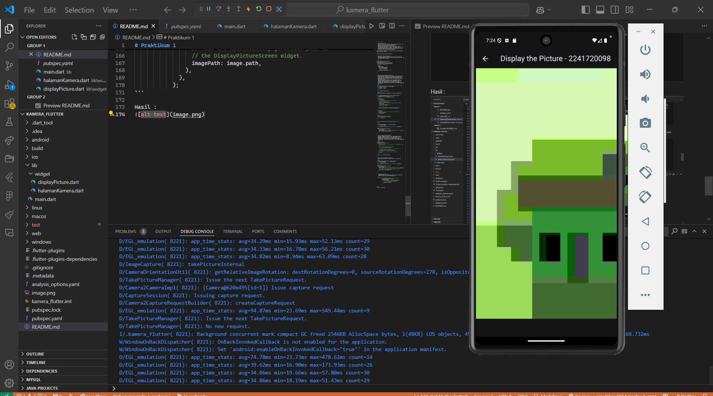
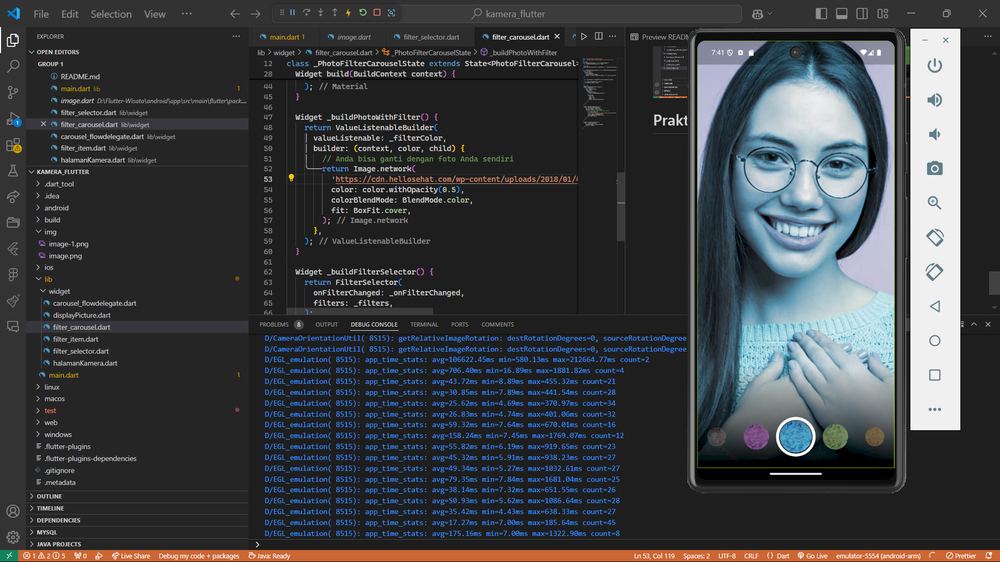

# Praktikum 1

1. Buat Project Baru <br>
   Buatlah sebuah project flutter baru dengan nama kamera_flutter, lalu sesuaikan style laporan praktikum yang Anda buat.
2. Langkah 2: Tambah dependensi yang diperlukan <br>
   Anda memerlukan tiga dependensi pada project flutter untuk menyelesaikan praktikum ini.<br>camera → menyediakan seperangkat alat untuk bekerja dengan kamera pada device..<br>path_provider → menyediakan lokasi atau path untuk menyimpan hasil foto..<br>path → membuat path untuk mendukung berbagai platform.

Untuk menambahkan dependensi plugin, jalankan perintah flutter pub add seperti berikut di terminal:

```
flutter pub add camera path_provider path
```

3. Ambil Sensor Kamera dari device <br>
   Selanjutnya, kita perlu mengecek jumlah kamera yang tersedia pada perangkat menggunakan plugin camera seperti pada kode berikut ini. Kode ini letakkan dalam void main().

```dart

late CameraDescription firstCamera;
Future<void> main() async {
  WidgetsFlutterBinding.ensureInitialized();
  final cameras = await availableCameras();
  firstCamera = cameras.first;

  runApp(
    MaterialApp(
      theme: ThemeData.dark(),
      home: TakePictureScreen(
        camera: firstCamera,
      ),
      debugShowCheckedModeBanner: false,
    ),
  );
}

```

4. Buat dan inisialisasi CameraController<br>
   Setelah Anda dapat mengakses kamera, gunakan langkah-langkah berikut untuk membuat dan menginisialisasi CameraController. Pada langkah berikut ini, Anda akan membuat koneksi ke kamera perangkat yang memungkinkan Anda untuk mengontrol kamera dan menampilkan pratinjau umpan kamera.<br><br>
   Anda dapat menggunakan CameraController untuk mengambil gambar menggunakan metode takePicture(), yang mengembalikan objek XFile, merupakan sebuah objek abstraksi File lintas platform yang disederhanakan. Pada Android dan iOS, gambar baru disimpan dalam direktori cache masing-masing, dan path ke lokasi tersebut dikembalikan dalam XFile.

```dart
// A screen that allows users to take a picture using a given camera.
class TakePictureScreen extends StatefulWidget {
  const TakePictureScreen({
    super.key,
    required this.camera,
  });

  final CameraDescription camera;

  @override
  TakePictureScreenState createState() => TakePictureScreenState();
}

class TakePictureScreenState extends State<TakePictureScreen> {
  late CameraController _controller;
  late Future<void> _initializeControllerFuture;

  @override
  void initState() {
    super.initState();
    // To display the current output from the Camera,
    // create a CameraController.
    _controller = CameraController(
      // Get a specific camera from the list of available cameras.
      widget.camera,
      // Define the resolution to use.
      ResolutionPreset.medium,
    );

    // Next, initialize the controller. This returns a Future.
    _initializeControllerFuture = _controller.initialize();
  }

  @override
  void dispose() {
    // Dispose of the controller when the widget is disposed.
    _controller.dispose();
    super.dispose();
  }

  @override
  Widget build(BuildContext context) {
    // Fill this out in the next steps.
    return Container();
  }
}
```

5.  Gunakan CameraPreview untuk menampilkan preview foto <br>

```dart

class DisplayPictureScreen extends StatelessWidget {
  final String imagePath;

  const DisplayPictureScreen({super.key, required this.imagePath});

  @override
  Widget build(BuildContext context) {
    return Scaffold(
      appBar: AppBar(title: const Text('Display the Picture - NIM Anda')),
      body: Image.file(File(imagePath)),
    );
  }
}
```

6. Ambil foto dengan CameraController<br>
   Anda dapat menggunakan CameraController untuk mengambil gambar menggunakan metode takePicture(), yang mengembalikan objek XFile, merupakan sebuah objek abstraksi File lintas platform yang disederhanakan. Pada Android dan iOS, gambar baru disimpan dalam direktori cache masing-masing, dan path ke lokasi tersebut dikembalikan dalam XFile.

```dart
FloatingActionButton(
  // Provide an onPressed callback.
  onPressed: () async {
    // Take the Picture in a try / catch block. If anything goes wrong,
    // catch the error.
    try {
      // Ensure that the camera is initialized.
      await _initializeControllerFuture;

      // Attempt to take a picture and then get the location
      // where the image file is saved.
      final image = await _controller.takePicture();
    } catch (e) {
      // If an error occurs, log the error to the console.
      print(e);
    }
  },
  child: const Icon(Icons.camera_alt),
)
```

7. Buat widget baru DisplayPictureScreen<br>
   Buatlah file baru pada folder widget yang berisi kode berikut.

```dart
// A widget that displays the picture taken by the user.
class DisplayPictureScreen extends StatelessWidget {
  final String imagePath;

  const DisplayPictureScreen({super.key, required this.imagePath});

  @override
  Widget build(BuildContext context) {
    return Scaffold(
      appBar: AppBar(title: const Text('Display the Picture - NIM Anda')),
      // The image is stored as a file on the device. Use the `Image.file`
      // constructor with the given path to display the image.
      body: Image.file(File(imagePath)),
    );
  }
}
```

8.  Menampilkan hasil foto <br>
    Tambahkan kode seperti berikut pada bagian try / catch agar dapat menampilkan hasil foto pada DisplayPictureScreen.

```dart
   // If the picture was taken, display it on a new screen.
            await Navigator.of(context).push(
              MaterialPageRoute(
                builder: (context) => DisplayPictureScreen(
                  // Pass the automatically generated path to
                  // the DisplayPictureScreen widget.
                  imagePath: image.path,
                ),
              ),
            );
```

Hasil :



# Praktikum 2

1. Buatlah folder widget dan file baru yang berisi kode berikut.

```dart
@immutable
class FilterSelector extends StatefulWidget {
  const FilterSelector({
    super.key,
    required this.filters,
    required this.onFilterChanged,
    this.padding = const EdgeInsets.symmetric(vertical: 24),
  });

  final List<Color> filters;
  final void Function(Color selectedColor) onFilterChanged;
  final EdgeInsets padding;

  @override
  State<FilterSelector> createState() => _FilterSelectorState();
}

class _FilterSelectorState extends State<FilterSelector> {
  static const _filtersPerScreen = 5;
  static const _viewportFractionPerItem = 1.0 / _filtersPerScreen;

  late final PageController _controller;
  late int _page;

  int get filterCount => widget.filters.length;

  Color itemColor(int index) => widget.filters[index % filterCount];

  @override
  void initState() {
    super.initState();
    _page = 0;
    _controller = PageController(
      initialPage: _page,
      viewportFraction: _viewportFractionPerItem,
    );
    _controller.addListener(_onPageChanged);
  }

  void _onPageChanged() {
    final page = (_controller.page ?? 0).round();
    if (page != _page) {
      _page = page;
      widget.onFilterChanged(widget.filters[page]);
    }
  }

  void _onFilterTapped(int index) {
    _controller.animateToPage(
      index,
      duration: const Duration(milliseconds: 450),
      curve: Curves.ease,
    );
  }

  @override
  void dispose() {
    _controller.dispose();
    super.dispose();
  }

  @override
  Widget build(BuildContext context) {
    return Scrollable(
      controller: _controller,
      axisDirection: AxisDirection.right,
      physics: const PageScrollPhysics(),
      viewportBuilder: (context, viewportOffset) {
        return LayoutBuilder(
          builder: (context, constraints) {
            final itemSize = constraints.maxWidth * _viewportFractionPerItem;
            viewportOffset
              ..applyViewportDimension(constraints.maxWidth)
              ..applyContentDimensions(0.0, itemSize * (filterCount - 1));

            return Stack(
              alignment: Alignment.bottomCenter,
              children: [
                _buildShadowGradient(itemSize),
                _buildCarousel(
                  viewportOffset: viewportOffset,
                  itemSize: itemSize,
                ),
                _buildSelectionRing(itemSize),
              ],
            );
          },
        );
      },
    );
  }

  Widget _buildShadowGradient(double itemSize) {
    return SizedBox(
      height: itemSize * 2 + widget.padding.vertical,
      child: const DecoratedBox(
        decoration: BoxDecoration(
          gradient: LinearGradient(
            begin: Alignment.topCenter,
            end: Alignment.bottomCenter,
            colors: [
              Colors.transparent,
              Colors.black,
            ],
          ),
        ),
        child: SizedBox.expand(),
      ),
    );
  }

  Widget _buildCarousel({
    required ViewportOffset viewportOffset,
    required double itemSize,
  }) {
    return Container(
      height: itemSize,
      margin: widget.padding,
      child: Flow(
        delegate: CarouselFlowDelegate(
          viewportOffset: viewportOffset,
          filtersPerScreen: _filtersPerScreen,
        ),
        children: [
          for (int i = 0; i < filterCount; i++)
            FilterItem(
              onFilterSelected: () => _onFilterTapped(i),
              color: itemColor(i),
            ),
        ],
      ),
    );
  }

  Widget _buildSelectionRing(double itemSize) {
    return IgnorePointer(
      child: Padding(
        padding: widget.padding,
        child: SizedBox(
          width: itemSize,
          height: itemSize,
          child: const DecoratedBox(
            decoration: BoxDecoration(
              shape: BoxShape.circle,
              border: Border.fromBorderSide(
                BorderSide(width: 6, color: Colors.white),
              ),
            ),
          ),
        ),
      ),
    );
  }
}
```

2. Buat widget photo filter carousel

```dart
@immutable
class PhotoFilterCarousel extends StatefulWidget {
  const PhotoFilterCarousel({super.key});

  @override
  State<PhotoFilterCarousel> createState() => _PhotoFilterCarouselState();
}

class _PhotoFilterCarouselState extends State<PhotoFilterCarousel> {
  final _filters = [
    Colors.white,
    ...List.generate(
      Colors.primaries.length,
      (index) => Colors.primaries[(index * 4) % Colors.primaries.length],
    )
  ];

  final _filterColor = ValueNotifier<Color>(Colors.white);

  void _onFilterChanged(Color value) {
    _filterColor.value = value;
  }

  @override
  Widget build(BuildContext context) {
    return Material(
      color: Colors.black,
      child: Stack(
        children: [
          Positioned.fill(
            child: _buildPhotoWithFilter(),
          ),
          Positioned(
            left: 0.0,
            right: 0.0,
            bottom: 0.0,
            child: _buildFilterSelector(),
          ),
        ],
      ),
    );
  }

  Widget _buildPhotoWithFilter() {
    return ValueListenableBuilder(
      valueListenable: _filterColor,
      builder: (context, color, child) {
        // Anda bisa ganti dengan foto Anda sendiri
        return Image.network(
          'https://docs.flutter.dev/cookbook/img-files'
          '/effects/instagram-buttons/millennial-dude.jpg',
          color: color.withOpacity(0.5),
          colorBlendMode: BlendMode.color,
          fit: BoxFit.cover,
        );
      },
    );
  }

  Widget _buildFilterSelector() {
    return FilterSelector(
      onFilterChanged: _onFilterChanged,
      filters: _filters,
    );
  }
}
```

3. Membuat filter warna

```dart
import 'package:flutter/material.dart';
import 'package:flutter/rendering.dart';
import 'dart:math' as math;

class CarouselFlowDelegate extends FlowDelegate {
  CarouselFlowDelegate({
    required this.viewportOffset,
    required this.filtersPerScreen,
  }) : super(repaint: viewportOffset);

  final ViewportOffset viewportOffset;
  final int filtersPerScreen;

  @override
  void paintChildren(FlowPaintingContext context) {
    final count = context.childCount;

    // All available painting width
    final size = context.size.width;

    // The distance that a single item "page" takes up from the perspective
    // of the scroll paging system. We also use this size for the width and
    // height of a single item.
    final itemExtent = size / filtersPerScreen;

    // The current scroll position expressed as an item fraction, e.g., 0.0,
    // or 1.0, or 1.3, or 2.9, etc. A value of 1.3 indicates that item at
    // index 1 is active, and the user has scrolled 30% towards the item at
    // index 2.
    final active = viewportOffset.pixels / itemExtent;

    // Index of the first item we need to paint at this moment.
    // At most, we paint 3 items to the left of the active item.
    final min = math.max(0, active.floor() - 3).toInt();

    // Index of the last item we need to paint at this moment.
    // At most, we paint 3 items to the right of the active item.
    final max = math.min(count - 1, active.ceil() + 3).toInt();

    // Generate transforms for the visible items and sort by distance.
    for (var index = min; index <= max; index++) {
      final itemXFromCenter = itemExtent * index - viewportOffset.pixels;
      final percentFromCenter = 1.0 - (itemXFromCenter / (size / 2)).abs();
      final itemScale = 0.5 + (percentFromCenter * 0.5);
      final opacity = 0.25 + (percentFromCenter * 0.75);

      final itemTransform = Matrix4.identity()
        ..translate((size - itemExtent) / 2)
        ..translate(itemXFromCenter)
        ..translate(itemExtent / 2, itemExtent / 2)
        ..multiply(Matrix4.diagonal3Values(itemScale, itemScale, 1.0))
        ..translate(-itemExtent / 2, -itemExtent / 2);

      context.paintChild(
        index,
        transform: itemTransform,
        opacity: opacity,
      );
    }
  }

  @override
  bool shouldRepaint(covariant CarouselFlowDelegate oldDelegate) {
    return oldDelegate.viewportOffset != viewportOffset;
  }
}
```



# Tugas Praktikum

1. Gabungkan hasil praktikum 1 dengan hasil praktikum 2 sehingga setelah melakukan pengambilan foto, dapat dibuat filter carouselnya!
   <br><br>
2. Jelaskan maksud void async pada praktikum 1?<br>
   async: Kata kunci async digunakan untuk menandai bahwa sebuah fungsi adalah asynchronous atau tidak berjalan secara langsung (synchronous). Fungsi dengan async memungkinkan penggunaan await di dalamnya, yang berguna untuk menunggu operasi asynchronous (misalnya pengambilan data dari internet, membaca file, dll) selesai tanpa menghalangi jalannya program utama.
   Jadi, void async menunjukkan fungsi asynchronous yang tidak mengembalikan nilai apa pun.<br><br>
3. Jelaskan fungsi dari anotasi @immutable dan @override ?<br>
   Anotasi @immutable digunakan untuk menandai bahwa semua properti dari suatu kelas tidak dapat diubah (immutable) setelah objek kelas tersebut dibuat. Anotasi ini biasanya digunakan pada kelas yang merupakan subclass dari StatelessWidget dalam Flutter.
   Ketika kelas diberi anotasi @immutable, semua properti di dalamnya harus diberi nilai sekali (biasanya pada konstruktor) dan tidak boleh diubah lagi. Hal ini membantu mencegah perubahan tidak sengaja pada objek, yang penting dalam pola desain aplikasi yang lebih aman dan predictable.
