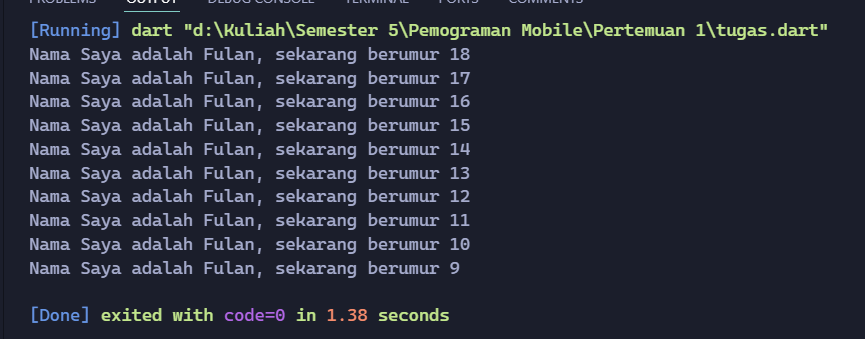

### Soal 1  
Hasil  

### Soal 2  
Mengapa sangat penting untuk memahami bahasa pemrograman Dart sebelum kita menggunakan framework Flutter ? Jelaskan!
  
Jawaban :  Karena flutter merupakan framework yang menggunakan bahasa dart, seluruh code dalam flutter baik widget, state managemen dan lain – lain juga menggunakan dart sehingga dart perlu dipelajari sebelum menggunakan framework flutter

### Soal 3  
Rangkumlah materi dari codelab ini menjadi poin-poin penting yang dapat Anda gunakan untuk membantu proses pengembangan aplikasi mobile menggunakan framework Flutter.
  
Jawaban :  
- framework adalah bagian dari sebuah bangunan atau sebuah objek yang mendukung bobot dan memberikan suatu bentuk
- Framework sengaja diciptakan untuk membantu developer mengembangkan aplikasi lebih cepat serta tersusun dan terstruktur
- Flutter diprogram dengan menggunakan bahasa Dart sebuah bahasa modern yang dapat dicompile ke arsitektur processor ARM atau javascript
- Widget adalah sebuah konsep dimana UI dapat dianggap sebagai sebuah balok LEGO
- Dart bertujuan untuk menggabungkan kelebihan-kelebihan dari sebagian besar bahasa tingkat tinggi dengan fitur-fitur Productive tooling, Garbage collection, Type annotations, Statically typed, Portability
- Diluncurkan pada tahun 2011, Dart telah berkembang sejak saat itu. Dart merilis versi stabilnya pada tahun 2013
- Mencoba memecahkan masalah pada JavaScript, Menawarkan performa terbaik dan alat yang lebih baik untuk proyek berskala besar, Dibentuk agar kuat dan fleksibel
- hot reload didasarkan pada kompiler Dart JIT. Hal Ini memungkinkan pengembang untuk mendapatkan umpan balik yang sangat cepat terhadap perubahan kode yang dilakukan
